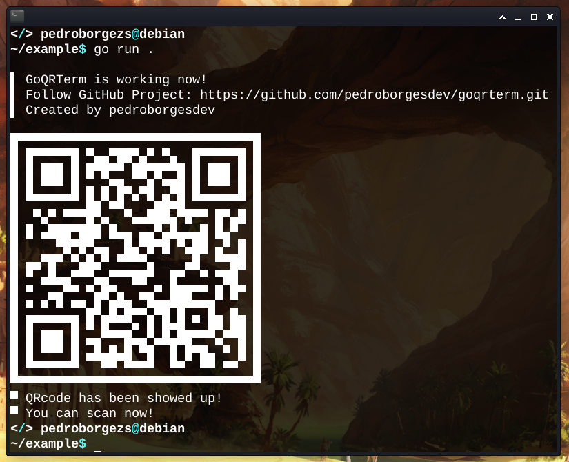
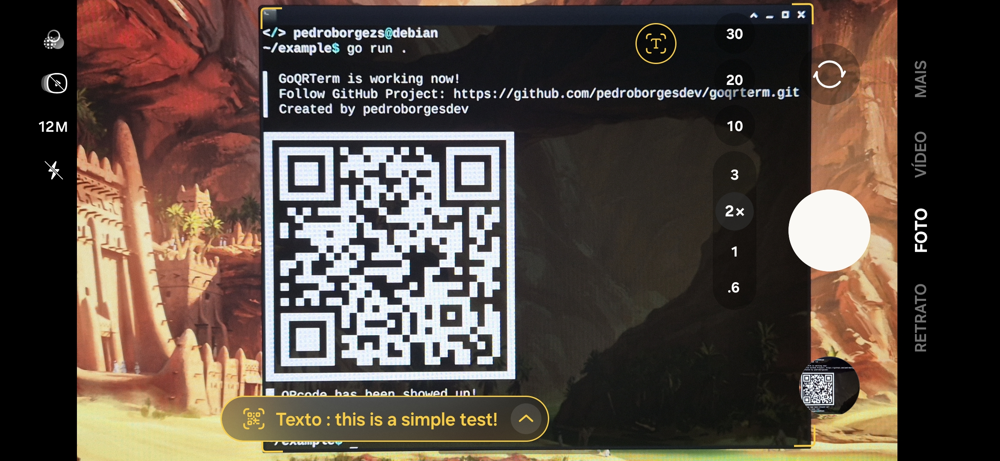

# 🖥️ GoQRTerm

**Generate and display QR codes directly in your terminal with ease!**

---

## 📦 Installation

Import the module into your Go project:

```go
package main

import (
	"github.com/pedroborgesdev/goqrterm"
)
```

---

## 🚀 Usage

Simply call the `Print` function with the content you want to encode:

```go
func main() {
	goqrterm.Print("this is a simple test!")
}
```

---

## 🖼️ Example Output

When executed, your terminal will display the following QR code:

<p align="center">
  
</p>

---

## 📱 Scan the QR Code

You can easily scan the displayed QR code with your smartphone to view the content:

<p align="center">
  
</p>

---

## 💡 Features

✅ Simple to use
✅ Pure Go
✅ Terminal-friendly QR code display

---

## 📝 License

Distributed under the MIT License. See `LICENSE` for more information.
